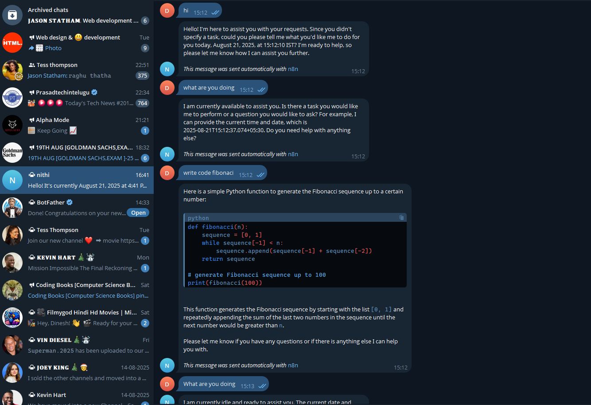
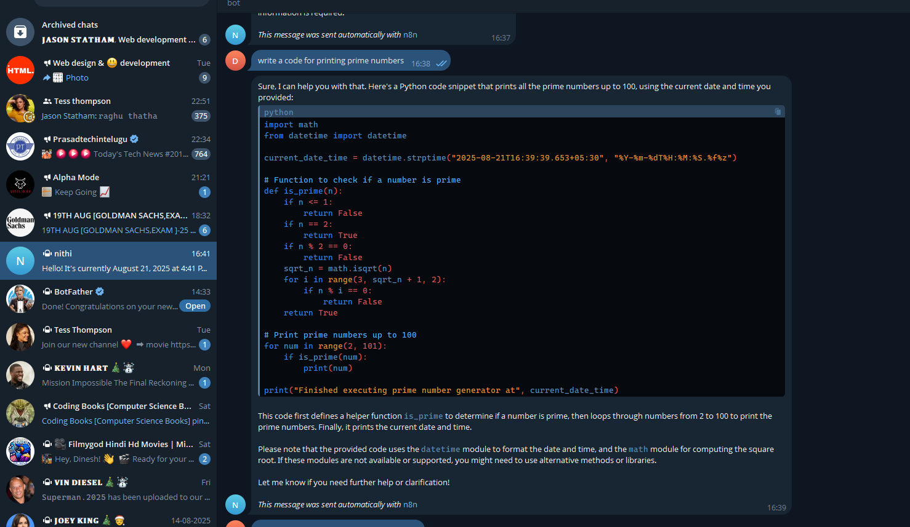
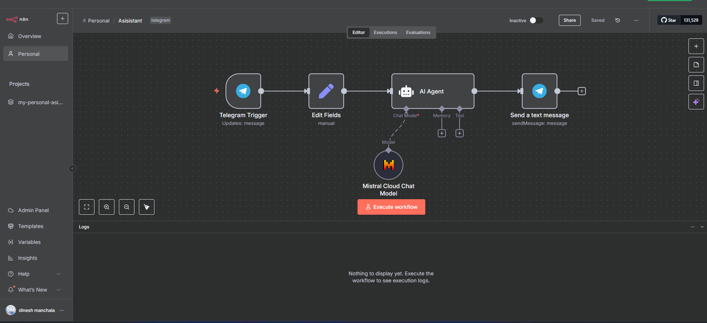
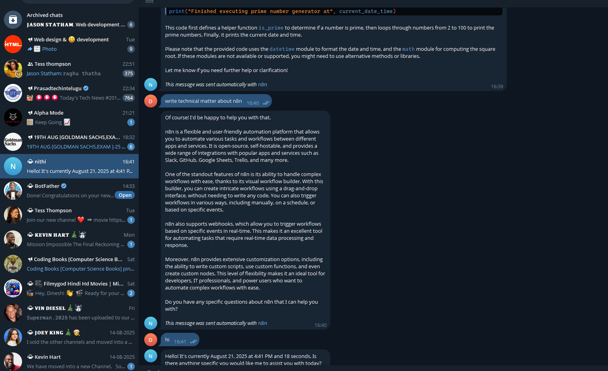

# Nithi – AI-Powered Telegram Chatbot 🤖

[](https://telegram.org)
[](https://n8n.io)
[](https://mistral.ai)
[](LICENSE)

**Nithi** (**Next-Gen Intelligent Telegram Helper Interface**) is a Telegram chatbot that delivers real-time, AI-driven conversations using **n8n automation**, **Mistral's LLM**, and **Telegram APIs**. No coding required! 🚀

---

## 🌐 Telegram Interface



---

## 🚀 Features

- 🤖 **AI-Powered Conversations**: Answers contextual queries using Mistral’s chat model.
- ⚙️ **Automated Workflow**: Built with n8n for easy customization.
- 📡 **Real-Time Messaging**: Handles Telegram messages via webhooks.
- 🧠 **AI Agent Logic**: Manages reasoning and API interactions autonomously.





---

## 🧪 Sample Outputs

### ⚙️ n8n Workflow
The workflow includes Telegram triggers, Mistral LLM, and AI agent nodes.



**How to Capture**:
1. Open the n8n dashboard at [http://localhost:5678](http://localhost:5678).
2. Load `nithi-workflow.json` in the workflow editor.
3. Use a screenshot tool (e.g., Snipping Tool on Windows, Shift+Command+4 on Mac) to capture the canvas.
4. Save as `screenshots/nithi-workflow.png` in your repository.

### 📱 Telegram Chat
Example interaction with the Nithi bot.



**How to Capture**:
1. Start a chat with your bot (e.g., `@NithiBot`) on Telegram.
2. Send messages like “Who are you?” or “What can you do?”.
3. Take a screenshot in the Telegram app or web interface.
4. Save as `screenshots/nithi-chat.png` in your repository.

---

## 🛠️ Technologies Used

- **n8n** – Workflow automation platform
- **Mistral LLM** – AI model for conversational responses
- **Telegram Bot API** – Real-time messaging integration
- **AI Agent Node** – Advanced logic in n8n workflows

---

## 📋 Prerequisites

- **Docker** (recommended) or **Node.js** installed.
- **Telegram Bot Token**: Obtain from [BotFather](https://t.me/BotFather) on Telegram.
- **Mistral API Key**: Get from [Mistral.ai](https://mistral.ai).
- **nithi-workflow.json**: Included in this repository.

---

## 📦 Setup

1. **Clone the Repository**:
2. 
   ```bash
 https://github.com/Dineshmanchala19/NITHI-BOT.git
 
Run n8n in Docker (Recommended):
bashdocker run -it --rm \
  -p 5678:5678 \
  -v ~/.n8n:/home/node/.n8n \
  -e N8N_ENCRYPTION_KEY=your_secure_key \
  -e TELEGRAM_BOT_TOKEN=your_telegram_token \
  -e MISTRAL_API_KEY=your_mistral_api_key \
  n8nio/n8n
```
Access n8n Dashboard: Open http://localhost:5678.
Import Workflow:

Go to Workflows → Import → Import from File.
Select nithi-workflow.json and activate it.


Start Chatting: Use your Telegram bot (e.g., @NithiBot).

Alternative (Node.js):

Install n8n:
bashnpm install -g n8n

Set environment variables and start:
bashexport N8N_ENCRYPTION_KEY=your_secure_key
export TELEGRAM_BOT_TOKEN=your_telegram_token
export MISTRAL_API_KEY=your_mistral_api_key
n8n start

Follow steps 3–4 above.


⚠️ Disclaimer
This project is for educational and experimental purposes. The chatbot’s responses depend on the Mistral LLM and user inputs. It is not intended for critical applications without further validation.

📌 Usage
Start a chat with your Telegram bot (e.g., @NithiBot).
Try prompts like:

"Who are you?"
"Tell me something interesting."
"What can you do?"

Get real-time, AI-generated responses.


📜 License
MIT License
